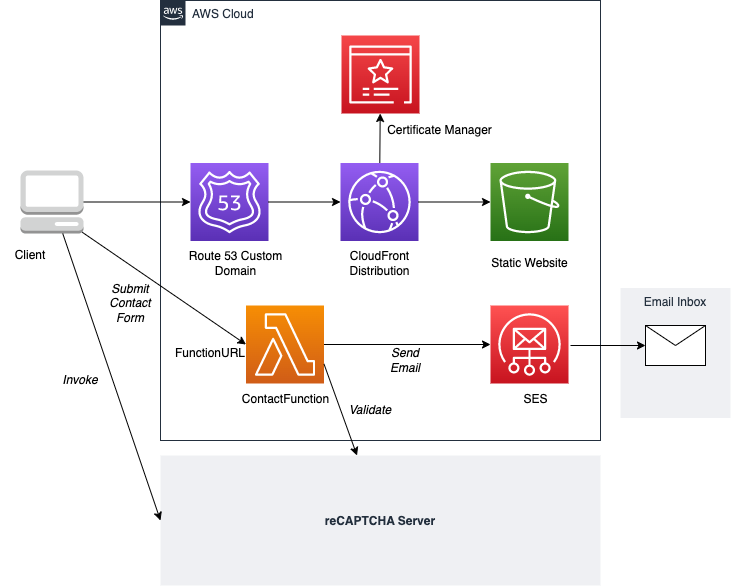

# sebastianhof.com

The personal homepage of @sebastianhof based on the free React.js template [UIdeck Resume](https://uideck.com/templates/resume-react/).

## Overview

The page is hosted as a static website in an Amazon S3 bucket, distributed via Amazon CloudFront, and available on the custom domain `https://sebastianhof.com`.
A Lambda function send the contact form data via SES to my email address. A Lambda function URL serves as the endpoint.



The project contains two CDK stacks:

- to setup and deploy the static website (`SebastianhofComStack`)
- to setup and deploy the contact form lambda function (`SebastianhofComContactStack`)

## Getting Started

### Pre-requisites

- [Node.js 16](https://nodejs.org/en/download/current/)
- [AWS CDK Toolkit](https://docs.aws.amazon.com/cdk/v2/guide/cli.html)
- [reCAPTCHA v3](https://www.google.com/recaptcha/admin) keys
- [Registered domain in Amazon Route53](https://docs.aws.amazon.com/Route53/latest/DeveloperGuide/domain-register.html)


### Deploy

1. Adjust the `domainName` and `bucketName` in `sebastianhof.com.ts` to your registered domain in Route53. Make sure the `bucketName` is globally unique.

2. Store reCAPTCHA v3 secret key as string value for `RECAPTCHA_SECRET_KEY` parameter in AWS Systems Manager - Parameter Store

3. Deploy SebastianhofComContactStack

```
cdk deploy SebastianhofComContactStack
```

As an output you will obtain the `SebastianhofComContactStack.ContactFunctionURL`

4. Create an .env file in the project root folder

```
REACT_APP_CONTACT_URL=<SebastianhofComContactStack.ContactFunctionURL>
REACT_APP_RECAPTCHA_KEY=<reCaptchaWebsiteKey>
```

5. Build your static website

```
npm run build-react
```

6. Deploy SebastianhofComStack

```
cdk deploy SebastianhofComStack
```
